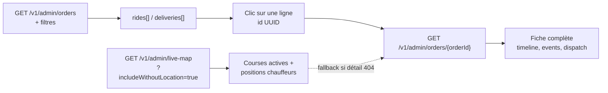

# Courses admin — liste filtrée et détail

> Document de référence (juin 2026)  
> Base API : `https://api.upjunoo-dev.tech`  
> Page front : `/admin/ops/trips` → `/admin/ops/trips/{id}`

Ce guide explique **comment lister les courses avec des filtres**, puis **comment ouvrir le détail d’une course** issue de cette liste. Les exemples JSON proviennent des réponses réelles de l’API dev.

---

## 1. Principe général



| Étape | Route | Rôle |
|-------|-------|------|
| **Liste** | `GET /v1/admin/orders` | Table paginée + `filterOptions` pour les selects |
| **Détail** | `GET /v1/admin/orders/{orderId}` | Fiche agrégée (route **préférée**) |
| **Carte live** | `GET /v1/admin/live-map` | Courses en cours + chauffeurs (complément, pas le détail seul) |

**Point important :** les filtres de la liste (`franchise_id`, `status`, `dateFrom`…) ne se repassent **pas** sur la route détail. On récupère l’`id` d’une ligne filtrée, puis on appelle le détail **uniquement par UUID**.

---

## 2. Authentification

Toutes les routes admin exigent un JWT Bearer obtenu via login.

```bash
curl -X POST "https://api.upjunoo-dev.tech/v1/auth/login" \
  -H "Content-Type: application/json" \
  -d '{
    "email": "dev.admin@upjunoo-dev.tech",
    "password": "Upjunoo@Dev2026!"
  }'
```

Réponse (extrait) :

```json
{
  "status": "ok",
  "session": {
    "access_token": "eyJhbGciOiJFUzI1NiIs..."
  }
}
```

Headers à réutiliser sur les routes courses :

```
Authorization: Bearer <access_token>
X-Client-Type: back-office
Accept: application/json
```

---

## 3. Liste des courses — `GET /v1/admin/orders`

### 3.1 URL de base

```
GET https://api.upjunoo-dev.tech/v1/admin/orders?page=1&limit=25
```

### 3.2 Paramètres de filtre supportés

| Paramètre query | Exemple | Usage front (`TripsListPage`) |
|-----------------|---------|-------------------------------|
| `page` | `1` | Numéro de page |
| `limit` | `25` | Taille de page (équivalent `per_page` côté front) |
| `status` | `in_progress` | Chip statut (requested, matching, assigned, arrived, in_progress, completed, cancelled) |
| `service` | `RIDE` | Type de service (`RIDE`, `DELIVERY`, …) |
| `franchise_id` | `82781966-5ca5-4a67-9147-1a6dd245e31d` | Filtre périmètre franchise |
| `partner_id` | `1be2ed48-e48e-4287-83f8-ec6193af5dde` | Filtre périmètre partenaire |
| `dateFrom` | `2026-06-09` | Début de plage (YYYY-MM-DD) |
| `dateTo` | `2026-06-09` | Fin de plage (YYYY-MM-DD) |
| `search` | *(texte libre)* | Recherche — **peu fiable** sur l’API actuelle |

### 3.3 Exemples curl avec filtres combinés

**Liste par défaut (25 dernières courses paginées) :**

```bash
curl "https://api.upjunoo-dev.tech/v1/admin/orders?page=1&limit=25" \
  -H "Authorization: Bearer $TOKEN" \
  -H "X-Client-Type: back-office"
```

**Courses en cours uniquement :**

```bash
curl "https://api.upjunoo-dev.tech/v1/admin/orders?page=1&limit=25&status=in_progress" \
  -H "Authorization: Bearer $TOKEN" \
  -H "X-Client-Type: back-office"
```

**Périmètre franchise + journée précise :**

```bash
curl "https://api.upjunoo-dev.tech/v1/admin/orders?page=1&limit=25\
&franchise_id=82781966-5ca5-4a67-9147-1a6dd245e31d\
&dateFrom=2026-06-09&dateTo=2026-06-09" \
  -H "Authorization: Bearer $TOKEN" \
  -H "X-Client-Type: back-office"
```

**Partenaire spécifique :**

```bash
curl "https://api.upjunoo-dev.tech/v1/admin/orders?page=1&limit=25\
&partner_id=1be2ed48-e48e-4287-83f8-ec6193af5dde" \
  -H "Authorization: Bearer $TOKEN" \
  -H "X-Client-Type: back-office"
```

### 3.4 Enveloppe de réponse

```json
{
  "status": "ok",
  "generatedAt": "2026-06-09T10:34:01.420Z",
  "rides": [ /* courses taxi */ ],
  "deliveries": [ /* courses livraison — souvent vide */ ],
  "filterOptions": {
    "franchises": [
      {
        "id": "82781966-5ca5-4a67-9147-1a6dd245e31d",
        "name": "UPJUNOO Burkina Faso",
        "city": "Ouagadougou",
        "cityLabel": "Ouagadougou"
      }
    ],
    "partners": [
      {
        "id": "1be2ed48-e48e-4287-83f8-ec6193af5dde",
        "name": "BF Pending Coop",
        "franchiseId": "82781966-5ca5-4a67-9147-1a6dd245e31d"
      }
    ]
  },
  "pagination": {
    "page": 1,
    "limit": 25,
    "total": 17307,
    "totalPages": 693,
    "hasMore": true,
    "hasNext": true,
    "hasPrev": false
  }
}
```

Le bloc **`filterOptions`** alimente directement les listes déroulantes Franchise / Partenaire sur la page Courses. Si `partners` est vide, le front retombe sur `GET /v1/admin/filter-options` puis le dashboard.

### 3.5 Objet course dans `rides[]` (liste)

Exemple réel (champs utiles pour la table et pour enchaîner vers le détail) :

```json
{
  "id": "d87adeca-affb-41d3-815f-ebec0ea8accb",
  "order_reference": "TR-D87ADECA",
  "client_id": "b922506e-b145-4a4f-a56f-4c037d7dcb53",
  "driver_id": "f0c530c1-4612-43dc-bc3b-391e4de94f00",
  "franchise_id": "82781966-5ca5-4a67-9147-1a6dd245e31d",
  "partner_id": "1be2ed48-e48e-4287-83f8-ec6193af5dde",
  "city_id": "7e8a6c9b-d559-4920-8fbf-f42a67453516",
  "service_type": "RIDE",
  "category_code": "ECO",
  "status": "in_progress",
  "payment_status": "pending",
  "payment_method_code": "CASH",
  "pickup_address": "Gare routière, Ouagadougou",
  "pickup_latitude": 12.3714,
  "pickup_longitude": -1.5197,
  "dropoff_address": "Zone du Bois, Ouagadougou",
  "dropoff_latitude": 12.3652,
  "dropoff_longitude": -1.5342,
  "estimated_price_xof": 2800,
  "final_price_xof": 2800,
  "created_at": "2026-06-09T10:43:23.279321+00:00",
  "started_at": "2026-06-09T10:43:23.188+00:00",
  "client": {
    "id": "b922506e-b145-4a4f-a56f-4c037d7dcb53",
    "displayName": "test-1780575039@example.com",
    "phone": null
  },
  "driver": {
    "id": "f0c530c1-4612-43dc-bc3b-391e4de94f00",
    "displayName": "Seed seed bf bf-p4 d05",
    "phone": null
  },
  "partnerName": "BF Pending Coop",
  "franchiseName": "UPJUNOO Burkina Faso"
}
```

**Champ clé pour le détail :** `id` (UUID). C’est lui qui est utilisé dans l’URL front `/admin/ops/trips/{id}`.

---

## 4. Détail d’une course — `GET /v1/admin/orders/{orderId}`

### 4.1 Appel

À partir d’une ligne de la liste filtrée, récupérer `rides[i].id` puis :

```bash
curl "https://api.upjunoo-dev.tech/v1/admin/orders/d87adeca-affb-41d3-815f-ebec0ea8accb" \
  -H "Authorization: Bearer $TOKEN" \
  -H "X-Client-Type: back-office"
```

**Aucun filtre de liste n’est nécessaire** : le détail est global par UUID. Une course visible dans une liste filtrée par franchise reste accessible par son `id` même hors filtre.

### 4.2 Réponse agrégée

```json
{
  "status": "ok",
  "generatedAt": "2026-06-09T10:46:05.812Z",
  "order": {
    "serviceType": "RIDE",
    "orderId": "a6b95224-7c93-4365-af20-a1319aeb2e21",
    "ref": "TR-A6B95224",
    "clientName": "test-1780575039@example.com",
    "clientPhone": "+225...",
    "driverName": "Seed seed ci ci-p1 d13",
    "driverPhone": "+225...",
    "amountXof": 2800,
    "commissionXof": 420,
    "driverEarningXof": 2380,
    "ride": { /* même structure que rides[] en liste, enrichie */ },
    "driver": {
      "id": "...",
      "displayName": "...",
      "vehicle": { "model": "Toyota Yaris", "plate": "..." }
    },
    "timeline": {
      "current": "completed",
      "steps": [
        { "status": "requested", "at": "2026-06-09T10:41:13Z", "done": true },
        { "status": "in_progress", "at": "2026-06-09T10:41:12Z", "done": true },
        { "status": "completed", "at": "2026-06-09T10:44:23Z", "done": true, "current": true }
      ]
    },
    "events": [
      {
        "id": "...",
        "event_type": "ride.created",
        "old_status": null,
        "new_status": "requested",
        "created_at": "2026-06-09T10:41:13Z"
      }
    ],
    "dispatch": {
      "status": "completed",
      "dispatch": {
        "offers": [],
        "candidates": []
      }
    },
    "tracking": {},
    "pricing": {},
    "receipt": {}
  }
}
```

### 4.3 Champs détail vs liste

| Besoin UI | Liste `rides[]` | Détail `order` |
|-----------|-----------------|----------------|
| Référence | `order_reference` | `ref` ou `ride.order_reference` |
| Client | `client.displayName` | `clientName`, `clientPhone` |
| Chauffeur | `driver.displayName` (souvent null) | `driverName`, `driver`, `driverSummary` |
| Montants | `final_price_xof` | `amountXof`, `commissionXof`, `driverEarningXof` |
| Timeline | timestamps isolés (`started_at`, …) | `timeline.steps[]` + `events[]` |
| Dispatch / offres | `metadata.dispatch` (partiel) | `dispatch.dispatch.offers[]` |
| Véhicule | non garanti | `driver.vehicle` |

**Toujours préférer cette route** plutôt que de re-parser la liste ou le live-map.

---

## 5. Carte live — `GET /v1/admin/live-map`

Complément pour les **courses actives** et la **position temps réel** des chauffeurs.

```bash
curl "https://api.upjunoo-dev.tech/v1/admin/live-map?includeWithoutLocation=true" \
  -H "Authorization: Bearer $TOKEN" \
  -H "X-Client-Type: back-office"
```

Paramètres optionnels (mêmes périmètres que la liste) :

| Paramètre | Exemple |
|-----------|---------|
| `includeWithoutLocation` | `true` — inclure chauffeurs sans GPS récent |
| `franchiseId` | UUID franchise |
| `partnerId` | UUID partenaire |

### 5.1 Structure utile

```json
{
  "status": "ok",
  "generatedAt": "2026-06-09T10:34:01.420Z",
  "drivers": [
    {
      "id": "f0c530c1-4612-43dc-bc3b-391e4de94f00",
      "driverCode": "BF-DRV-BF-P4-05",
      "availabilityStatus": "on_trip",
      "location": {
        "lat": 12.3714,
        "lng": -1.5197,
        "heading": 180,
        "recordedAt": "2026-06-09T10:43:50Z"
      },
      "profile": { "displayName": "Seed seed bf bf-p4 d05" }
    }
  ],
  "orders": {
    "rides": [ /* courses en cours — même forme que admin/orders */ ],
    "deliveries": []
  },
  "meta": {
    "onlineInDatabase": 42,
    "withRecentLocation": 38,
    "realtime": { "socketUrl": "...", "room": "admin:live-map" }
  }
}
```

### 5.2 Quand utiliser le live-map ?

| Cas | Route |
|-----|-------|
| Ouvrir la fiche complète d’une course | `GET /v1/admin/orders/{id}` |
| Afficher la course sur la carte ops | `live-map.orders.rides[]` |
| Suivre le chauffeur en direct sur la fiche | `live-map.drivers[]` + socket `admin:live-map` |
| Retrouver une course si le détail admin échoue | Fallback front : chercher dans `live-map.orders` puis `admin/orders` |

Le live-map contient typiquement les **courses actives** (~centaines), pas l’historique complet paginé de `admin/orders` (~milliers).

---

## 6. Chaîne côté front (UpJunoo Pro)

### 6.1 Liste — `TripsListPage`

Fichiers : `src/features/ops/pages/TripsListPage.tsx`, `trips.service.ts`, `adminOrders.mapper.ts`

1. L’utilisateur choisit statut, service, franchise, partenaire, dates.
2. Le front construit la query via `buildV1ListQuery()` (`src/core/api/v1Pagination.ts`).
3. Appel parallèle :
   - `GET /v1/admin/orders?...`
   - `GET /v1/admin/drivers?page=1&limit=100` (enrichissement noms chauffeurs si `driver.displayName` manquant)
4. Mapping vers le modèle UI `Trip[]` + `meta.pagination`.

Exemple de query générée quand l’utilisateur filtre « En cours » + franchise BF + 09/06/2026 :

```
/v1/admin/orders?page=1&limit=25&status=in_progress
  &franchise_id=82781966-5ca5-4a67-9147-1a6dd245e31d
  &dateFrom=2026-06-09&dateTo=2026-06-09
```

### 6.2 Détail — `TripDetailPage`

Fichiers : `src/features/ops/pages/TripDetailPage.tsx`, `tripDetail.service.ts`

1. Navigation : `/admin/ops/trips/{id}` (l’`id` vient de la ligne cliquée).
2. **Priorité 1** : `GET /v1/admin/orders/{id}` → `mapAdminOrderDetailToTripDetail()`.
3. **Fallback** (si erreur ≠ 404) : `resolveAdminOrder(id)` cherche dans live-map puis liste complète.
4. Si course en cours : `useTripDriverLiveLocation` interroge le live-map / socket pour la position chauffeur.

```typescript
// tripDetail.service.ts — logique simplifiée
const detail = await fetchAdminOrderById(id);        // route préférée
// sinon :
const { order, liveMap } = await resolveAdminOrder(id); // live-map → liste
```

### 6.3 Liens API (`links.ts`)

```typescript
LINKS.admin.v1.orders          // GET /v1/admin/orders
LINKS.admin.v1.orderById(id)   // GET /v1/admin/orders/{id}
LINKS.admin.v1.liveMap         // GET /v1/admin/live-map
LINKS.admin.v1.filterOptions   // GET /v1/admin/filter-options
```

---

## 7. Mapping statuts et services

### Statuts API → UI

| API (`status`) | UI front (`TripStatus`) |
|----------------|-------------------------|
| `requested` | `requested` |
| `dispatching`, `matching` | `matching` |
| `assigned`, `accepted` | `assigned` |
| `arrived` | `arrived` |
| `in_progress`, `started` | `in_progress` |
| `completed` | `completed` |
| `cancelled` | `cancelled` |

### Types de service

| API (`service_type`) | UI (`Trip.service`) |
|----------------------|---------------------|
| `RIDE`, `TAXI` | `taxi` |
| `DELIVERY` | `delivery` |
| `RENTAL` | `rental` |
| `FREIGHT` | `freight` |

Paramètre filtre liste : envoyer `service=RIDE` (code API), pas `taxi`.

---

## 8. Scénario complet pas à pas

**Objectif :** afficher le détail d’une course « en cours » du partenaire BF Pending Coop du 09/06/2026.

```bash
# 1. Login
TOKEN=$(curl -s -X POST "https://api.upjunoo-dev.tech/v1/auth/login" \
  -H "Content-Type: application/json" \
  -d '{"email":"dev.admin@upjunoo-dev.tech","password":"Upjunoo@Dev2026!"}' \
  | jq -r '.session.access_token')

# 2. Liste filtrée
curl -s "https://api.upjunoo-dev.tech/v1/admin/orders\
?page=1&limit=25&status=in_progress\
&partner_id=1be2ed48-e48e-4287-83f8-ec6193af5dde\
&dateFrom=2026-06-09&dateTo=2026-06-09" \
  -H "Authorization: Bearer $TOKEN" \
  -H "X-Client-Type: back-office" \
  | jq '.rides[0].id, .rides[0].order_reference, .pagination.total'

# 3. Détail (remplacer ORDER_ID)
curl -s "https://api.upjunoo-dev.tech/v1/admin/orders/ORDER_ID" \
  -H "Authorization: Bearer $TOKEN" \
  -H "X-Client-Type: back-office" \
  | jq '.order | {ref, clientName, driverName, amountXof, timeline}'

# 4. (Optionnel) Position chauffeur si course active
curl -s "https://api.upjunoo-dev.tech/v1/admin/live-map?includeWithoutLocation=true" \
  -H "Authorization: Bearer $TOKEN" \
  -H "X-Client-Type: back-office" \
  | jq '.drivers[] | select(.availabilityStatus=="on_trip") | {id, location}'
```

---

## 9. Routes à ne pas utiliser pour l’admin

| Route | Problème |
|-------|----------|
| `GET /v1/rides/{id}` | Scope client → `RIDE_NOT_FOUND` pour l’admin |
| `GET /v1/orders/RIDE/{id}` | Souvent `ORDER_NOT_FOUND` sur l’environnement dev |
| Recherche dans toute la liste sans pagination | Trop lourd (~17k+ courses) |

Routes **debug / forensic** (compléments, pas fiche principale) :

- `GET /v1/dispatch/RIDE/{orderId}/status`
- `GET /v1/dispatch/RIDE/{orderId}/logs`
- `GET /v1/orders/RIDE/{orderId}/events`

---

## 10. Écarts connus (juin 2026)

| Sujet | Constat |
|-------|---------|
| `driver.displayName` en liste | Souvent `null` malgré un `driver_id` → le front joint `GET /v1/admin/drivers` |
| `search` sur `admin/orders` | Retourne 0 résultat pour une référence exacte `TR-…` |
| `partnerName` / `franchiseName` | Parfois `null` en liste ; mieux renseignés en détail |
| Filtres sur le détail | **Non supportés** — uniquement par `orderId` |
| Live-map vs liste | Live-map = actif ; liste = historique paginé filtré |


