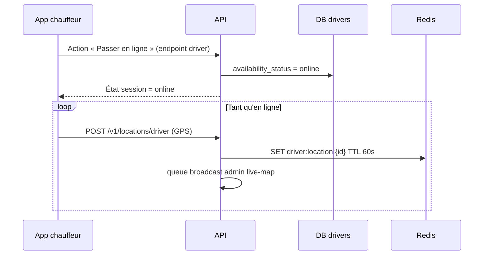

# Demande backend — synchronisation disponibilité chauffeur (back-office ↔ app mobile)

**Date :** juin 2026  
**Portails concernés :** Admin, Franchise (et actions bulk admin)  
**Environnement observé :** préprod LIVE (`api.upjunoo-dev.tech`)  
**Priorité :** haute — incohérence métier entre opérateurs et chauffeurs sur le terrain

---

## 1. Résumé du problème

Lorsqu’un opérateur **met un chauffeur en ligne** depuis le back-office Upjunoo (fiche chauffeur admin, liste avec action groupée, portail franchise), **l’état « en ligne » est visible côté back-office** (liste, fiche, parfois carte live), **mais pas sur l’application mobile chauffeur**.

**Symptôme côté chauffeur :** l’app mobile continue d’afficher le chauffeur comme **hors ligne** ; le bouton / l’état de session mobile n’est pas basculé.

**Impact métier :**
- L’opérateur pense que le chauffeur peut recevoir des courses.
- Le chauffeur ne se considère pas en ligne et ne reçoit pas le dispatch comme attendu.
- Risque de courses manquées, de support, et de perte de confiance dans les outils ops.

---

## 2. Comportement attendu vs observé

| Acteur | Action | Attendu | Observé |
|--------|--------|---------|---------|
| Admin / Franchise | « Mettre en ligne » | Chauffeur **en ligne partout** : BO + mobile + dispatch | En ligne **uniquement** sur le back-office |
| Chauffeur mobile | « Passer en ligne » | En ligne partout | Fonctionne (référence correcte) |
| Admin | Carte live | Chauffeur visible / traçable si en ligne | Variable : statut DB peut dire « online » sans GPS Redis ni session mobile |

**Principe produit attendu :**  
`availability_status = online` doit représenter **une seule vérité métier**, quel que soit le canal qui déclenche le changement (mobile **ou** back-office).

---

## 3. Ce que fait le front back-office aujourd’hui

Le front **ne simule pas** la mise en ligne localement en production : il appelle l’API backend.

### 3.1 Admin — fiche chauffeur & liste (bulk)

**Fichier front :** `src/features/fleet/api/driverAdminActions.service.ts`

**Appel API (mode v1 LIVE) :**

```http
PATCH /v1/admin/drivers/{driverId}
Content-Type: application/json
Authorization: Bearer <JWT admin>

{
  "availability_status": "online",
  "availability": "online"
}
```

Pour « hors ligne » : mêmes champs avec `"offline"`.

**Écrans :**
- Fiche : `DriverDetailPage` → bouton « Mettre en ligne » / « Hors ligne »
- Liste : `DriversListPage` → actions groupées « Mettre en ligne » / « Hors ligne »

**Préconditions front :** compte chauffeur `account_status === "approved"` (sinon bouton masqué).

### 3.2 Franchise

**Fichier front :** `src/features/franchise/api/drivers.service.ts`

```http
PATCH /v1/franchise/drivers/{franchiseId}/drivers/{driverId}
{
  "availability_status": "online",
  "availability": "online"
}
```

(Même logique pour offline.)

### 3.3 Lecture de l’état affiché sur le back-office

Le back-office affiche `availability` à partir de **`availability_status`** renvoyé par :

- `GET /v1/admin/drivers` (liste)
- `GET /v1/admin/drivers/{id}` (détail)
- équivalents franchise / partenaire (lecture seule côté partenaire)

**Mapper front :** `adminDrivers.mapper.ts`, `driverDetail.mapper.ts`  
Valeurs reconnues : `online`, `available`, `offline`, `on_trip`, `paused`, etc.

Après un PATCH réussi, le front **invalide le cache React Query** et relit la fiche → le BO affiche bien « En ligne ».

---

## 4. Hypothèse technique (cause probable)

D’après la doc interne carte live (`ADMIN-LIVE-MAP-SOCKET.md`) et l’architecture décrite, il semble exister **plusieurs couches d’état** qui ne sont pas toutes mises à jour par le PATCH admin :

| Couche | Rôle | Alimentée par |
|--------|------|----------------|
| **A. `drivers.availability_status` (DB)** | Affichage listes admin, filtres, live-map snapshot | PATCH admin/franchise **et** (?) app mobile |
| **B. Session / état runtime chauffeur** | Ce que lit l’app mobile (écran accueil, toggle en ligne) | Probablement **uniquement** endpoints **driver** (JWT chauffeur) |
| **C. Redis `driver:location:{id}`** | Position GPS temps réel, carte admin, dispatch géolocalisé | **`POST /v1/locations/driver`** (app mobile, TTL ~60 s) |
| **D. Broadcast Socket.IO** | Deltas carte admin `admin:live:locations` | Chaîne déclenchée par POST locations chauffeur |

**Scénario probable du bug :**

1. Le PATCH admin met à jour **uniquement la couche A** (`availability_status` en base).
2. Le GET admin renvoie `online` → le back-office affiche « En ligne ».
3. L’app mobile lit la **couche B** (endpoint driver / session) qui reste `offline`.
4. Sans POST locations, les couches **C** et **D** ne s’activent pas → pas de vraie présence opérationnelle.

En d’autres termes : **le back-office modifie un flag « administratif » en base, pas l’état de session opérationnel du chauffeur sur mobile.**

---

## 5. Référence : flux mobile « correct » (à aligner)

D’après la documentation carte live, le flux nominal côté chauffeur est :



**Attendu pour le PATCH admin/franchise :** reproduire **au minimum** les effets métier de la première partie (DB + session mobile), et idéalement signaler au mobile qu’il a été mis en ligne par un opérateur.

---

## 6. Questions ouvertes pour l’équipe backend

1. **Quel endpoint l’app mobile utilise-t-elle** pour lire l’état en ligne / hors ligne ? (`GET /v1/drivers/me`, autre ?)
2. **Quel endpoint l’app mobile appelle-t-elle** pour passer en ligne ? Est-ce le même service que le PATCH admin met à jour ?
3. Le PATCH `/v1/admin/drivers/:id` met-il à jour **uniquement** `availability_status` en table `drivers`, ou aussi :
   - une table/session driver runtime ?
   - un cache Redis de présence ?
   - un événement push / WebSocket vers l’app mobile ?
4. **`last_online_at`** est-il mis à jour lors d’un PATCH admin `online` ?
5. Un chauffeur mis en ligne **depuis le BO sans GPS** doit-il :
   - apparaître sur la carte avec `includeWithoutLocation=true` seulement ?
   - ou être considéré dispatchable sans position (règle métier à trancher) ?
6. Le portail **franchise** (`PATCH franchise/.../drivers/:id`) partage-t-il le même bug que l’admin ?

---

## 7. Pistes de correction backend (propositions)

### Option A — Unifier la logique métier (recommandée)

Extraire un service unique, par ex. `DriverAvailabilityService.setOnline(driverId, source)` appelé par :

- `POST/PATCH` endpoints **driver** (mobile)
- `PATCH` endpoints **admin** et **franchise**

Ce service doit **atomiquement** :
1. Valider `approval_status === approved` et compte non suspendu
2. Mettre à jour `availability_status` (+ `last_online_at` si online)
3. Mettre à jour l’état lu par l’app mobile (même source de vérité)
4. Émettre un événement temps réel vers le mobile si connecté (push, socket driver, ou invalidation au prochain poll)
5. (Optionnel) Initialiser une entrée Redis / file dispatch si règle métier l’exige

### Option B — Endpoint admin dédié

Si le PATCH générique driver n’est pas adapté :

```http
POST /v1/admin/drivers/{id}/set-availability
{ "availability": "online" | "offline", "source": "admin" }
```

→ délègue au même service que le mobile.

### Option C — Interdire côté produit (non recommandé sans accord)

Si la mise en ligne **doit** rester exclusivement mobile, le backend devrait renvoyer **403** ou **422** sur le PATCH admin, et le front retirerait les boutons. Ce n’est **pas** le comportement produit souhaité aujourd’hui.

---

## 8. Critères d’acceptation (recette)

### 8.1 Mise en ligne depuis admin

1. Chauffeur initialement **hors ligne** sur mobile (vérifié sur app réelle ou endpoint driver).
2. Admin : PATCH / bouton « Mettre en ligne ».
3. **Back-office** : `GET /v1/admin/drivers/{id}` → `availability_status: "online"`.
4. **App mobile** (sans action manuelle du chauffeur) : état affiché = **en ligne** dans un délai ≤ X s (à définir : immédiat si socket, ou au refresh).
5. Si le chauffeur était connecté à l’app : UI mobile reflète le changement (toggle, bandeau, ou notification).

### 8.2 Mise hors ligne depuis admin

1. Chauffeur en ligne sur mobile.
2. Admin : « Hors ligne ».
3. Mobile passe hors ligne ; plus de POST locations attendus ; dispatch ne le cible plus.

### 8.3 Franchise

Même scénario via `PATCH /v1/franchise/.../drivers/{id}`.

### 8.4 Non-régression mobile

1. Le chauffeur qui passe en ligne **depuis son mobile** continue de fonctionner comme avant.
2. Carte live + dispatch inchangés pour le flux mobile nominal.

### 8.5 Cas limites

| Cas | Résultat attendu |
|-----|------------------|
| Chauffeur suspendu | PATCH refusé (4xx), pas de changement mobile |
| Chauffeur en course (`on_trip`) | Hors ligne admin refusé ou forcé selon règle métier documentée |
| Chauffeur sans GPS | Statut online en DB + comportement carte documenté |

---

## 9. Contrat API suggéré (documentation Swagger)

Pour éviter toute ambiguïté front/back :

```yaml
PATCH /v1/admin/drivers/{id}:
  description: >
    Met à jour la fiche chauffeur. Si availability_status est fourni,
    doit synchroniser l'état opérationnel consommé par l'app mobile
    (même sémantique que l'endpoint driver go-online).
  requestBody:
    properties:
      availability_status:
        enum: [online, offline, paused]
      availability:
        enum: [online, offline]  # alias legacy accepté par le front
```

**Réponse attendue :** inclure l’objet driver normalisé avec `availability_status`, `last_online_at`, et idéalement un champ indiquant la source du changement :

```json
{
  "driver": {
    "id": "...",
    "availability_status": "online",
    "last_online_at": "2026-06-16T14:00:00.000Z",
    "availability_source": "admin"
  }
}
```

---

## 10. Ce que le front fera après correction backend

- Aucun changement obligatoire si le PATCH existant synchronise correctement mobile + DB.
- Optionnel : afficher un bandeau « Mis en ligne par un administrateur » si le backend expose `availability_source`.
- Optionnel : après mise en ligne admin, rappel UI « Le chauffeur doit autoriser la localisation sur son téléphone » si Redis/GPS reste vide.

**Le front ne peut pas corriger seul** l’état de l’app mobile : il n’a pas accès à la session JWT chauffeur ni au pipeline `POST /v1/locations/driver`.

---

## 11. Fichiers front de référence

| Fichier | Rôle |
|---------|------|
| `src/features/fleet/api/driverAdminActions.service.ts` | PATCH admin availability |
| `src/features/franchise/api/drivers.service.ts` | PATCH franchise availability |
| `src/features/fleet/pages/DriverDetailPage.tsx` | UI boutons |
| `src/features/fleet/pages/DriversListPage.tsx` | Bulk online/offline |
| `ADMIN-LIVE-MAP-SOCKET.md` | Doc Redis / locations / live-map |

---

## 12. Message court pour l’équipe backend

> Quand on fait `PATCH /v1/admin/drivers/:id` avec `availability_status: "online"`, le back-office voit le chauffeur en ligne car la DB est à jour, mais l’application mobile chauffeur reste hors ligne. Il semble que le PATCH admin ne passe pas par la même logique que le « go online » mobile (session driver + éventuellement locations Redis). Il faut unifier la mise à jour de disponibilité pour que admin, franchise et mobile partagent la même source de vérité opérationnelle.

---

*Document rédigé côté front Upjunoo backoffice — à compléter par l’équipe backend avec les endpoints mobile exacts et le plan de correctif.*
