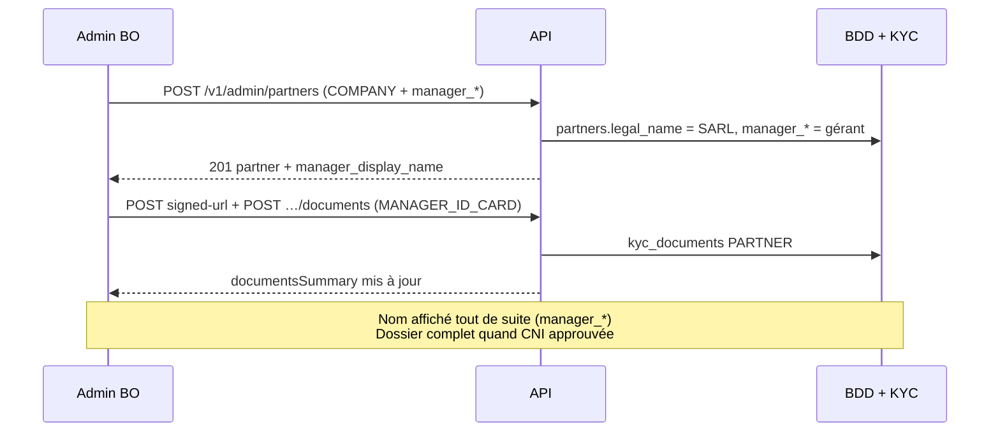

# Demande backend — Nom du gérant à la création partenaire (`legal_form = COMPANY`)

> **Destinataire :** équipe API UpJunoo  
> **Demandeur :** back-office UpJunoo Pro (`Up_prov2`)  
> **Date :** 2026-06-22  
> **Priorité :** moyenne (conformité / UX réseau)  
> **Swagger :** [https://api.upjunoo-dev.tech/docs](https://api.upjunoo-dev.tech/docs)  
> **Référence déployée :** [`PARTENAIRE-PERSONNE-PHYSIQUE-MORALE.md`](./PARTENAIRE-PERSONNE-PHYSIQUE-MORALE.md)

---

## 1. Contexte

Depuis la migration **113** (`partners.legal_form`), un partenaire peut être :

| `legal_form` | Signification | Identité principale |
|--------------|---------------|---------------------|
| `INDIVIDUAL` | Personne physique | Le partenaire **est** la personne (`legal_name` = nom de l’individu) |
| `COMPANY` | Personne morale | Le partenaire **est** la société (`legal_name` = raison sociale) |

Pour une **personne morale**, le représentant légal / gérant est aujourd’hui identifié **uniquement** via le document KYC `MANAGER_ID_CARD` (upload **après** création). Il n’existe **pas de champ texte officiel** pour saisir son nom lors du `POST` de création.

**Conséquence UX back-office :**

- La fiche partenaire affiche « Transports Soleil SARL » mais **pas « géré par Amadou Diallo »** tant que la CNI n’est pas déposée et lue.
- L’admin ne peut pas rechercher / filtrer par nom de gérant.
- Le formulaire de création ne peut pas distinguer clairement **société** vs **personne qui la représente**.

---

## 2. État actuel (vérifié)

### 2.1 Corps documenté — `POST /v1/admin/partners`

```jsonc
{
  "legal_name": "Transports Soleil SARL",
  "trade_name": "Soleil",
  "partner_type": "FLEET",
  "legal_form": "COMPANY",
  "email": "contact@soleil.ci",
  "password": "MotDePasse123"
}
```

**Champs absents :** `manager_name`, `manager_first_name`, `manager_last_name`, `legal_representative_name`, etc.

### 2.2 Swagger live (`POST /v1/partners`)

Body documenté : `{ legalName, tradeName?, partnerType?, cityId?, franchiseId?, commissionRate?, ... }` — **pas de nom de gérant**.

### 2.3 Côté front (`Up_prov2`)

Le service envoie déjà **en option** `firstName` / `lastName` sur `POST /v1/partners` :

```typescript
// src/features/network/api/partners.service.ts
...(payload.first_name?.trim() ? { firstName: payload.first_name.trim() } : {}),
...(payload.last_name?.trim() ? { lastName: payload.last_name.trim() } : {}),
```

Mais :

- Ces champs **ne sont pas documentés** dans la spec personne physique / morale ;
- Le formulaire admin **ne les expose pas** ;
- Leur sémantique est ambiguë (profil du compte portail ≠ gérant légal de la SARL).

### 2.4 Ce qui existe déjà (à ne pas confondre)

| Mécanisme | Rôle |
|-----------|------|
| `MANAGER_ID_CARD` | Preuve documentaire du gérant (nom sur la pièce) |
| `email` + `password` | Compte de connexion portail (souvent email générique `contact@…`) |
| `POST …/members` rôle `manager` | Membre d’équipe rattaché à un `user_id` existant — **pas** la création initiale |

---

## 3. Objectif

Permettre de **saisir et persister explicitement le nom du gérant / représentant légal** lors de la création (et modification) d’un partenaire **`legal_form = COMPANY`**, tout en gardant :

- `legal_name` = **raison sociale** (inchangé)
- `trade_name` = **nom commercial** (inchangé)
- `MANAGER_ID_CARD` = **preuve documentaire** (complémentaire, pas remplacé)

**Bénéfices :**

- Affichage immédiat en liste / fiche : *« Soleil Express — gérant : Amadou Diallo »*
- Recherche admin / franchise par nom de gérant
- Formulaire de création cohérent (bloc société + bloc gérant)
- Alignement OCR / validation KYC (comparer CNI uploadée vs nom saisi)

---

## 4. Proposition API

### 4.1 Nouveaux champs (création + mise à jour)

Acceptés en **snake_case** et **camelCase** (comme `legal_form` / `legalForm`).

| Champ proposé | Type | Obligatoire si | Description |
|---------------|------|----------------|-------------|
| `manager_first_name` / `managerFirstName` | string | `legal_form = COMPANY` (recommandé) | Prénom du gérant / représentant légal |
| `manager_last_name` / `managerLastName` | string | `legal_form = COMPANY` (recommandé) | Nom du gérant |
| `manager_full_name` / `managerFullName` | string | alternative | Alias une seule ligne (si pas prénom/nom séparés) |

**Règles suggérées :**

```text
SI legal_form = COMPANY :
  - Exiger manager_first_name + manager_last_name
    OU manager_full_name (min 2 caractères)
  - Interdire que legal_name soit confondu avec le seul nom du gérant
    (legal_name = raison sociale)

SI legal_form = INDIVIDUAL :
  - Ignorer ou rejeter manager_* (400 PARTNER_MANAGER_NOT_APPLICABLE)
  - legal_name = nom de la personne (comportement actuel)
```

### 4.2 Exemple — création admin personne morale

`POST /v1/admin/partners`

```jsonc
{
  "legal_name": "Transports Soleil SARL",
  "trade_name": "Soleil Express",
  "partner_type": "FLEET",
  "legal_form": "COMPANY",
  "manager_first_name": "Amadou",
  "manager_last_name": "Diallo",
  "email": "contact@soleil.ci",
  "password": "MotDePasse123",
  "city_id": "uuid-ville",
  "franchise_id": "uuid-franchise"
}
```

### 4.3 Exemple — création personne physique (inchangé)

```jsonc
{
  "legal_name": "Moussa Koné",
  "trade_name": "Taxi Moussa",
  "partner_type": "FLEET",
  "legal_form": "INDIVIDUAL",
  "email": "moussa@example.ci",
  "password": "MotDePasse123"
}
```

→ **Pas** de champs `manager_*`.

### 4.4 Exemple — self-service `POST /v1/partners`

Même champs acceptés pour cohérence admin / inscription partenaire.

### 4.5 Mise à jour

`PATCH /v1/admin/partners/:id`

```jsonc
{
  "manager_first_name": "Amadou",
  "manager_last_name": "Traoré"
}
```

Utile si changement de gérant sans recréer le partenaire.

---

## 5. Persistance & exposition en lecture

### 5.1 Stockage suggéré

Option A (recommandée) — colonnes dédiées sur `partners` :

```sql
manager_first_name varchar(100) NULL,
manager_last_name  varchar(100) NULL,
-- ou manager_full_name varchar(200) NULL
```

Option B — `partners.metadata` JSON (moins favorable pour recherche SQL).

### 5.2 Réponse création / détail / liste

Enrichir `partner` dans :

- `POST /v1/admin/partners` (201)
- `GET /v1/admin/partners/:id`
- `GET /v1/admin/partners` (chaque item)
- `GET /v1/franchises/:id/partners` (+ détail si alignement écart connu)
- `GET /v1/partners/:id`

```jsonc
{
  "partner": {
    "id": "…",
    "legal_form": "COMPANY",
    "legal_name": "Transports Soleil SARL",
    "trade_name": "Soleil Express",
    "manager_first_name": "Amadou",
    "manager_last_name": "Diallo",
    "manager_display_name": "Amadou Diallo",  // calculé côté API
    "documentsSummary": { "...": "..." }
  }
}
```

Pour `INDIVIDUAL` : `manager_*` = `null` (ou absent).

### 5.3 Recherche

Étendre le paramètre `search` existant sur `GET /v1/admin/partners` pour inclure :

- `manager_first_name`
- `manager_last_name`
- `manager_display_name`

---

## 6. Lien avec le compte portail (`email` / `user`)

**Demande explicite :** clarifier la sémantique dans Swagger.

| Scénario | Comportement souhaité |
|----------|----------------------|
| `COMPANY` + `manager_*` + `email` | `manager_*` = gérant légal **affiché** ; `email` = login portail (peut être `contact@…`) |
| Optionnel P2 | Si `firstName`/`lastName` envoyés **sans** `manager_*`, les copier vers `manager_*` quand `legal_form = COMPANY` |
| Optionnel P2 | Pré-remplir le profil user (`users` / `profiles`) avec `manager_*` si le compte créé est celui du gérant |

**Ne pas mélanger** avec `POST …/members` rôle `manager` (équipe interne).

---

## 7. Lien avec KYC `MANAGER_ID_CARD`

Le document **`MANAGER_ID_CARD` reste obligatoire** pour `COMPANY` (conformité).

Évolution possible (P2) :

- Comparer OCR CNI vs `manager_first_name` / `manager_last_name` saisis ;
- Flag `attention_flags.name_mismatch` si écart (informatif, non bloquant — aligné sur le modèle SOS / KYC chauffeur).

---

## 8. Codes d’erreur suggérés

| Code | HTTP | Cause |
|------|------|-------|
| `PARTNER_MANAGER_NAME_REQUIRED` | 400 | `legal_form = COMPANY` sans `manager_*` |
| `PARTNER_MANAGER_NOT_APPLICABLE` | 400 | `manager_*` envoyé avec `legal_form = INDIVIDUAL` |
| `PARTNER_LEGAL_NAME_REQUIRED` | 400 | inchangé — `legal_name` toujours requis |

---

## 9. Routes concernées

| Méthode | Route | Action |
|---------|-------|--------|
| `POST` | `/v1/admin/partners` | Accepter + persister `manager_*` si `COMPANY` |
| `PATCH` | `/v1/admin/partners/:id` | Modifier `manager_*` |
| `POST` | `/v1/partners` | Idem (self-service) |
| `PATCH` | `/v1/partners/:id` | Idem si autorisé |
| `GET` | listes + détails partenaire | Exposer `manager_*` + `manager_display_name` |
| Swagger | section création partenaire | Documenter champs + règles `legal_form` |

---

## 10. Intégration front prévue (après livraison)

| Fichier / écran | Changement |
|-----------------|------------|
| `PartnerCreateForm.tsx` | Si `COMPANY` → champs « Prénom / Nom du gérant » |
| `partners.service.ts` | Envoyer `managerFirstName` / `managerLastName` (remplacer l’usage ambigu de `firstName`/`lastName`) |
| `adminPartners.api.types.ts` | Types réponse |
| `adminPartners.mapper.ts` | Mapper vers UI |
| Liste / fiche partenaire admin & franchise | Afficher `manager_display_name` + badge dossier `documentsSummary` |
| `PARTENAIRE-PERSONNE-PHYSIQUE-MORALE.md` | Mise à jour §4.1 |

---

## 11. Critères d’acceptation

- [ ] `POST /v1/admin/partners` avec `legal_form: COMPANY` + `manager_first_name` + `manager_last_name` → **201** et champs persistés
- [ ] `GET /v1/admin/partners/:id` renvoie `manager_*` et `manager_display_name`
- [ ] `legal_form: INDIVIDUAL` + `manager_*` → **400** `PARTNER_MANAGER_NOT_APPLICABLE` (ou champs ignorés — **à trancher et documenter**)
- [ ] `search` trouve un partenaire par nom de gérant
- [ ] Swagger + exemples mis à jour
- [ ] `MANAGER_ID_CARD` toujours requis pour dossier `COMPANY` complet (`documentsSummary` inchangé sur ce point)

---

## 12. Priorisation suggérée

| Phase | Contenu |
|-------|---------|
| **P0** | Champs `manager_first_name` / `manager_last_name` en POST/PATCH + lecture GET |
| **P1** | `manager_display_name` calculé + recherche `search` |
| **P2** | Alignement profil user portail + contrôle OCR vs nom saisi |

---

## 13. Exemple parcours complet (cible)



---

## 14. Contact / suivi

Une fois livré en dev (`api.upjunoo-dev.tech`), prévenir l’équipe front pour :

1. Brancher le formulaire création admin (sélecteur physique / morale + bloc gérant)
2. Afficher le gérant en liste / fiche
3. Mettre à jour la doc interne `PARTENAIRE-PERSONNE-PHYSIQUE-MORALE.md`
