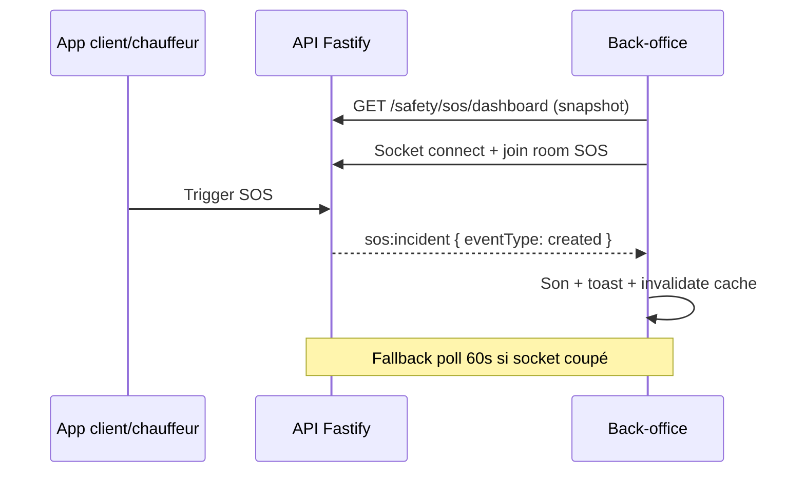

# Demande backend — SOS temps réel via Socket.IO

> **Destinataire :** équipe API UpJunoo  
> **Demandeur :** back-office UpJunoo Pro (`Up_prov2`)  
> **Date :** 2026-06-16  
> **Priorité :** haute (sécurité / ops)  
> **Swagger :** [https://api.upjunoo-dev.tech/docs](https://api.upjunoo-dev.tech/docs)

---

## 1. Contexte

Le module **SOS Guardian** (admin, franchise, partenaire) permet de surveiller les incidents de sécurité déclenchés par les clients ou chauffeurs.

**État actuel côté front :**

| Mécanisme | Intervalle | Limite |
|-----------|----------|--------|
| Dashboard SOS (`GET …/safety/sos/dashboard`) | polling **30 s** | Délai avant affichage d’une nouvelle alerte |
| Listener sonore global (`useSosIncomingSound`) | polling **15 s** | Alerte sonore retardée, charge HTTP inutile |
| Détail incident | polling **30 s** | Position / timeline pas en temps réel |

**Vérification Swagger (v0.4.0)** : la section *WebSocket (Socket.IO)* documente `chat:message`, `admin:live:locations`, `dispatch:*`, etc. **Aucun event SOS** n’existe aujourd’hui.

Le front a donc implémenté un **filet de sécurité par polling** — acceptable en transition, insuffisant pour un centre de sécurité.

---

## 2. Objectif

Exposer un canal **Socket.IO push** pour les événements SOS, sur le même modèle que :

- `chat:message` → room `user:{userId}`
- `admin:live:locations` → room `admin:live-map`

**Bénéfices attendus :**

- Alerte sonore et toast **quasi instantanés** (< 1 s)
- Mise à jour live du dashboard Guardian sans poll permanent
- Moins de requêtes `GET …/dashboard` répétées sur tous les postes ops
- Base propre pour la suite : carte SOS live, compteur header, notifications multi-onglets

---

## 3. Périmètre fonctionnel

### 3.1 Événements à pousser

| `eventType` | Quand | Impact front |
|-------------|-------|--------------|
| `created` | Nouvel incident SOS (trigger mobile) | Son + toast + carte Guardian |
| `updated` | Changement statut (`acknowledged`, `escalated`…) | Mise à jour liste / détail |
| `escalated` | Montée de `escalation_level` ou flag `escalated` | Son urgent + highlight |
| `location` | Nouveau point GPS incident (optionnel P1) | Carte détail / tracking |
| `resolved` / `cancelled` | Clôture incident | Retrait de la liste active |

Un seul event socket peut porter un champ `eventType` (recommandé) plutôt que 5 events distincts.

### 3.2 Portails concernés

| Portail | JWT / scope | Room suggérée |
|---------|-------------|---------------|
| **Admin** (siège) | `ADMIN`, `SUPER_ADMIN`, `OPS_ADMIN` | `admin:sos-guardian` |
| **Franchise** | `franchise_id` du JWT | `franchise:{franchiseId}:sos` |
| **Partenaire** | `partner_id` du JWT | `partner:{partnerId}:sos` |

Règle de filtrage : un partenaire ne reçoit que les incidents de **sa flotte** ; une franchise que son **territoire** ; l’admin le **réseau** (avec filtres `franchiseId` / `partnerId` optionnels côté payload).

---

## 4. Proposition technique Socket.IO

### 4.1 Connexion (identique aux autres sockets)

```
URL : wss://api.upjunoo-dev.tech
Auth : { token: "<JWT accessToken>" }
Client : socket.io-client v4
```

Auto-join des rooms selon le rôle au `connect` (comme `admin:live-map`).

### 4.2 Event serveur → client

**Nom proposé :** `sos:incident`

**Direction :** serveur → client (room scope)

**Payload minimal (camelCase, aligné API REST existante) :**

```json
{
  "eventType": "created",
  "incident": {
    "id": "uuid",
    "status": "active",
    "severity": "critical",
    "actorType": "DRIVER",
    "incidentType": "safety",
    "trigger": "manual_button",
    "riskScore": 87,
    "escalationLevel": 1,
    "silentMode": false,
    "latitude": 5.345,
    "longitude": -4.012,
    "triggeredAt": "2026-06-16T14:32:00.000Z",
    "franchiseId": "uuid",
    "partnerId": "uuid",
    "driverId": "uuid",
    "orderId": "uuid",
    "attentionFlags": {
      "gpsLost": false,
      "highRisk": true,
      "escalated": false
    }
  },
  "stats": {
    "active": 3,
    "acknowledged": 1,
    "escalated": 1,
    "critical": 1,
    "highRisk": 2,
    "gpsLost": 0
  },
  "generatedAt": "2026-06-16T14:32:00.100Z"
}
```

**Notes :**

- `incident` : même forme que `GET /v1/admin/safety/sos/{id}` (ou sous-ensemble documenté).
- `stats` : optionnel mais utile pour mettre à jour les KPIs sans refetch dashboard.
- `eventType: "location"` peut ne contenir que `{ incidentId, latitude, longitude, recordedAt, batteryLevel }`.

### 4.3 Event client → serveur (optionnel P2)

| Event | Usage |
|-------|--------|
| `sos:subscribe` | Rejoindre explicitement une room (si pas d’auto-join) |
| `sos:subscribe_incident` | Room `sos:incident:{id}` pour le détail live |

### 4.4 Bloc `meta.realtime` dans le dashboard HTTP

Comme `GET /v1/admin/live-map` renvoie `meta.realtime`, enrichir :

```
GET /v1/admin/safety/sos/dashboard
GET /v1/franchises/{id}/safety/sos/dashboard
GET /v1/partners/{id}/safety/sos/dashboard
```

Exemple :

```json
{
  "dashboard": { "...": "..." },
  "meta": {
    "realtime": {
      "socketUrl": "https://api.upjunoo-dev.tech",
      "event": "sos:incident",
      "room": "admin:sos-guardian"
    }
  }
}
```

Le front pourra ainsi configurer le hook socket sans constantes en dur.

---

## 5. Déclencheurs backend (où émettre)

| Moment métier | `eventType` |
|---------------|-------------|
| `POST` trigger SOS (app client / chauffeur) | `created` |
| Règle d’escalade auto / montée `escalation_level` | `escalated` ou `updated` |
| `POST …/acknowledge` | `updated` |
| `POST …/resolve` | `resolved` |
| Annulation côté mobile | `cancelled` |
| Ingestion point GPS incident | `location` |

---

## 6. Intégration front prévue (après livraison API)

Fichiers cibles dans `Up_prov2` :

| Fichier | Rôle |
|---------|------|
| `src/features/safety/api/sosSocket.realtime.ts` | Constantes event + parse payload |
| `src/features/safety/hooks/useAdminSosSocket.ts` | Connexion + rooms admin |
| `src/features/safety/hooks/useFranchiseSosSocket.ts` | Scope franchise |
| `src/features/safety/hooks/usePartnerSosSocket.ts` | Scope partenaire |
| `src/features/safety/hooks/useSosIncomingSound.ts` | **Socket prioritaire**, polling 60 s en fallback |
| `src/features/safety/api/sos.queries.ts` | Réduire `refetchInterval` ou le désactiver si socket OK |

Pattern calqué sur :

- `useSupportChatSocket` + `AdminChatSoundListener`
- `useAdminLiveMapSocket` + merge HTTP/socket

---

## 7. Critères d’acceptation

- [ ] Event `sos:incident` documenté dans Swagger (section WebSocket)
- [ ] Auto-join room selon rôle JWT (admin / franchise / partenaire)
- [ ] Push < **2 s** après création incident en préprod
- [ ] Isolation : partenaire A ne reçoit pas les SOS du partenaire B
- [ ] `meta.realtime` présent sur les 3 endpoints dashboard SOS
- [ ] Codes `join_denied` cohérents si JWT invalide ou hors scope
- [ ] Test manuel : déclencher SOS sandbox → event reçu sur poste admin connecté

---

## 8. Routes REST existantes (inchangées)

Snapshot initial + actions — **le socket ne remplace pas le HTTP** :

| Route | Rôle |
|-------|------|
| `GET /v1/admin/safety/sos/dashboard` | Snapshot admin |
| `GET /v1/admin/safety/sos` | Liste paginée |
| `GET /v1/admin/safety/sos/{id}` | Détail |
| `POST /v1/admin/safety/sos/{id}/acknowledge` | Prise en charge |
| `POST /v1/admin/safety/sos/{id}/resolve` | Clôture |
| `GET /v1/franchises/{franchiseId}/safety/sos/...` | Équivalent franchise |
| `GET /v1/partners/{partnerId}/safety/sos/...` | Équivalent partenaire |

Séquence recommandée :



---

## 9. Priorisation suggérée

| Phase | Contenu |
|-------|---------|
| **P0** | `sos:incident` + rooms admin/franchise/partenaire + `created` / `updated` / `resolved` |
| **P1** | `meta.realtime` sur dashboard + `escalated` + stats dans le payload |
| **P2** | `location` live + room `sos:incident:{id}` pour écran détail |

---

## 10. Références internes front

- Son + polling actuel : `src/features/safety/hooks/useSosIncomingSound.ts`
- Constantes poll : `src/features/safety/api/sos.realtime.ts`
- Types incident : `src/features/safety/api/sos.types.ts`
- Modèle socket chat : `src/features/support/hooks/useSupportChatSocket.ts`
- Modèle socket carte : `ADMIN-LIVE-MAP-SOCKET.md`

---

## 11. Contact / suivi

Une fois l’event disponible en dev, prévenir l’équipe front pour :

1. Brancher `useAdminSosSocket` (et variantes franchise/partenaire)
2. Passer le listener sonore en mode socket-first
3. Mettre à jour `docs/API-SWAGGER-CONTEXT.md` si besoin
