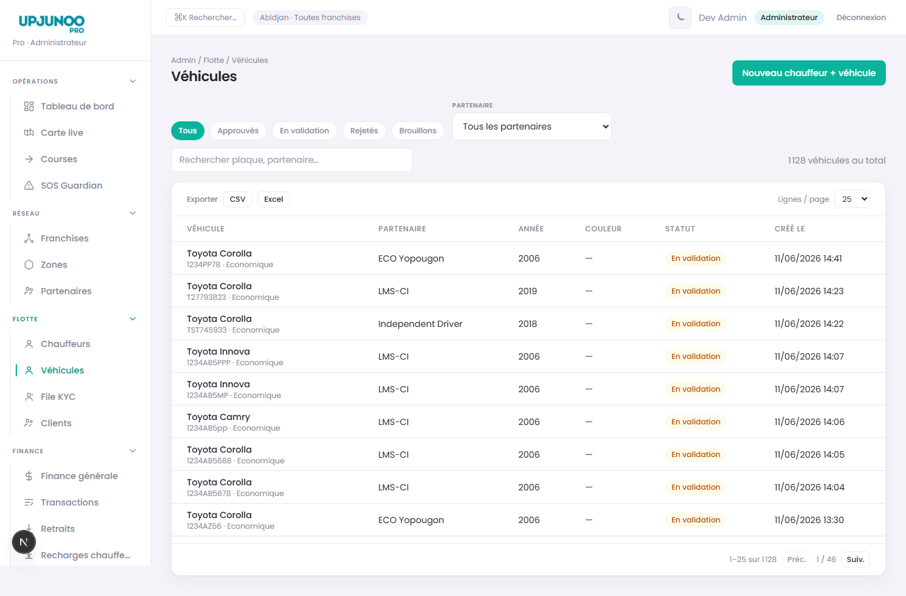
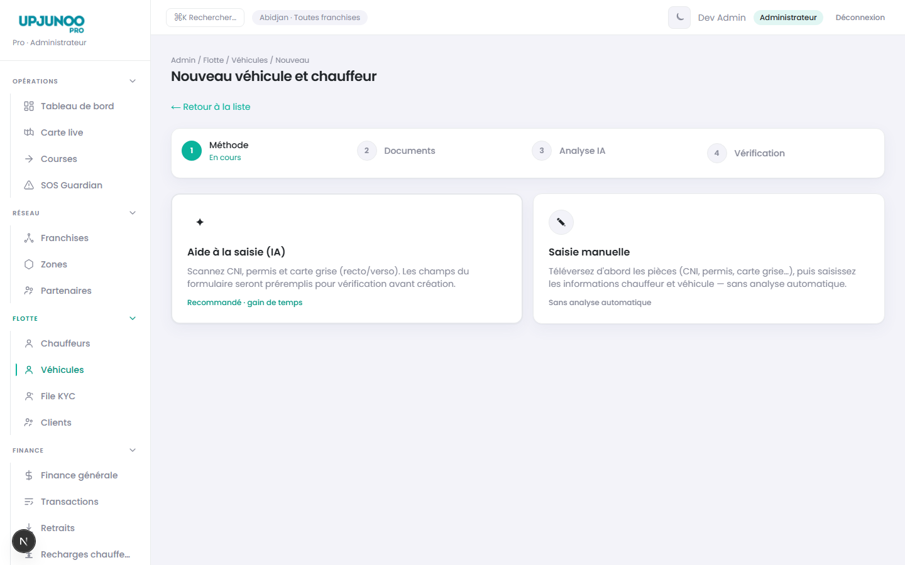
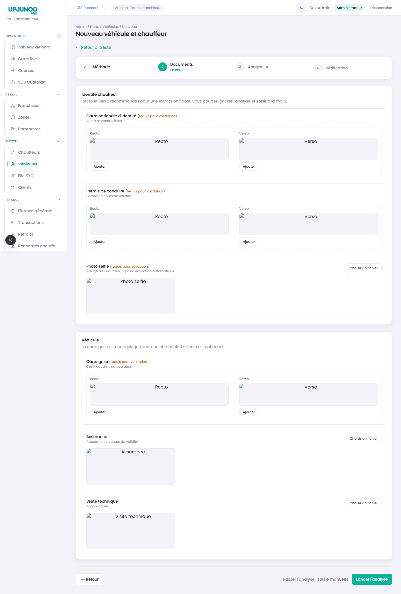
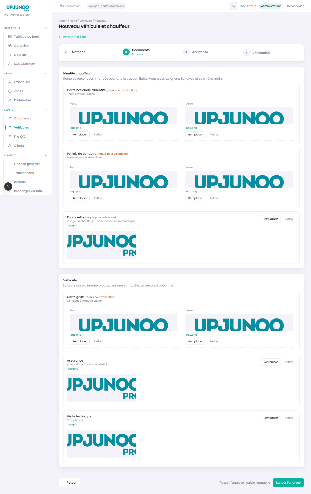
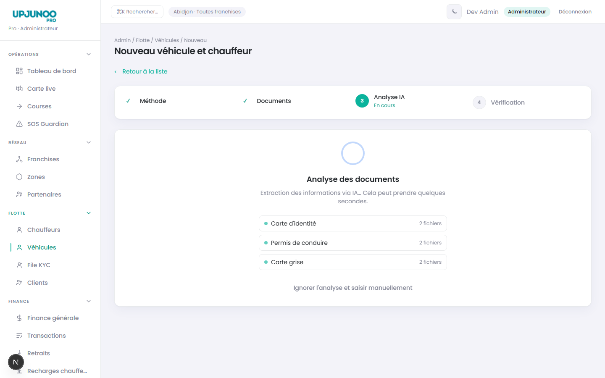
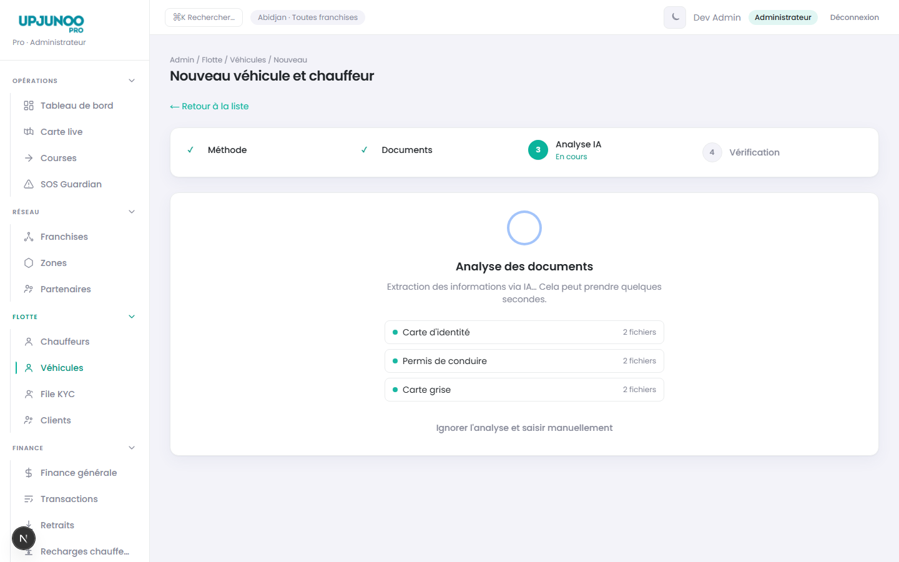
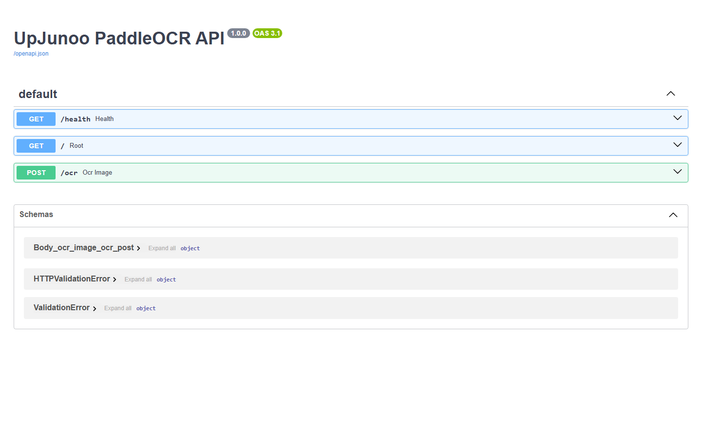
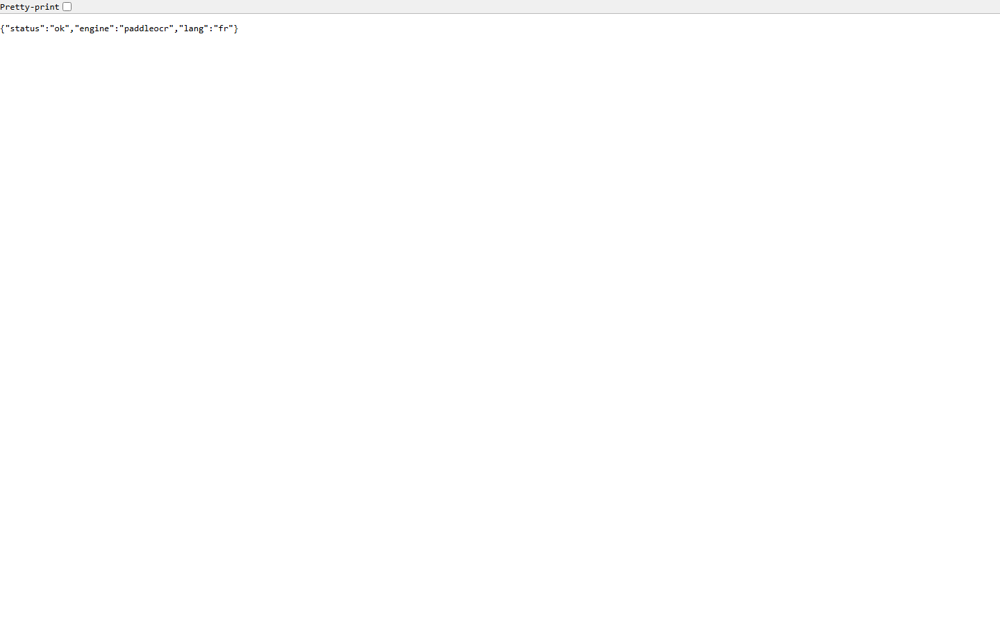

# Rapport d'activité — Extraction OCR & inscription chauffeur/véhicule

**Date :** 2 juin 2026  
**Projet :** UpJunoo Pro (back-office admin + portail partenaire)  
**Environnement :** `localhost:3000` · API `api.upjunoo-dev.tech` · OCR VPS `194.29.101.141:8866`

---

## Synthèse

Mise en place d’un **parcours d’inscription assisté par IA** dans le wizard de création chauffeur + véhicule : l’utilisateur téléverse CNI, permis et carte grise ; le système extrait automatiquement nom, plaque, marque, modèle, année, etc.

Deux moteurs d’extraction sont disponibles, commutables par configuration :

| Mode | Rôle | Données client |
|------|------|----------------|
| **OpenRouter (vision)** | Modèle cloud (ex. Gemini Flash) lit directement les images | Images envoyées au fournisseur IA (payant) |
| **Paddle VPS (recommandé prod)** | OCR **100 % local** sur notre VPS ; structuration JSON via OpenRouter en **texte seul** | Images OCR traitées sur notre infrastructure — **pas d’envoi d’images à un tiers pour l’OCR** |

**Motivation :** les modèles vision IA sont **payants à l’usage**. Pour maîtriser les coûts et garantir un **traitement local et propre des données personnelles** (CNI, permis), une **API PaddleOCR dédiée** a été déployée sur le VPS UpJunoo (`deploy/paddleocr-api`, FastAPI, langue `fr`).

---

## Captures d'écran

> Dossier : `docs/rapport-activite-2026-06-02/screenshots/`  
> Génération : `node scripts/capture-ocr-screenshots.mjs 2026-06-02`

### Parcours inscription (wizard)

| Écran | Capture |
|-------|---------|
| Liste véhicules |  |
| Choix mode IA / manuel |  |
| Téléversement documents |  |
| Pièces renseignées |  |
| Analyse en cours |  |
| Vérification & préremplissage |  |

### Infrastructure OCR VPS

| Écran | Capture |
|-------|---------|
| Swagger API PaddleOCR |  |
| Health check |  |

---

## Réalisations techniques

### 1. Wizard création paire chauffeur / véhicule

- Étape **Mode** : « Aide à la saisie (IA) » vs saisie manuelle.
- Étape **Documents** : CNI, permis, carte grise (recto/verso).
- Étape **Analyse** : extraction asynchrone par type de document.
- Étape **Vérification** : champs préremplis, badge **Extrait IA**, hint discret sur l’année (1ʳᵉ mise en circulation).

### 2. Route API Next.js `POST /api/document-extract`

- Dispatcher selon `DOCUMENT_EXTRACT_PROVIDER` : `openrouter` | `paddle`.
- Regroupement : recto + verso = **une requête par type** (cni, license, registration).
- Mode Paddle : OCR image par image sur le VPS, puis fusion du texte et structuration JSON.

### 3. API PaddleOCR sur VPS

- `POST /ocr` — multipart `file` (images JPEG/PNG).
- Réponse normalisée : `full_text`, `lines[]`, `line_count`.
- Déploiement : `deploy/paddleocr-api/` (Docker, PaddleOCR lang=fr).

### 4. Configuration

```env
DOCUMENT_EXTRACT_PROVIDER=paddle          # ou openrouter
PADDLE_OCR_BASE_URL=http://194.29.101.141:8866
OPENROUTER_API_KEY=...
OPENROUTER_MODEL=google/gemini-2.5-flash
```

---

## Flux de données (mode Paddle — production)

```
Navigateur → Next.js /api/document-extract
    → VPS POST /ocr (chaque image, local)
    → Texte OCR concaténé
    → OpenRouter (texte uniquement, pas d'image)
    → JSON structuré → préremplissage formulaire
```

---

## Livrables

| Fichier | Description |
|---------|-------------|
| `docs/RAPPORT-02062026.html` | Rapport brandé + captures (export PDF) |
| `scripts/capture-ocr-screenshots.mjs` | Captures Playwright wizard + VPS |
| `src/app/api/document-extract/*` | Pipeline extraction dual-provider |
| `deploy/paddleocr-api/` | Service OCR self-hosted |

---

## Commandes

```bash
npm run dev
node scripts/capture-ocr-screenshots.mjs 2026-06-02
node docs/generate-rapport-pdf.mjs RAPPORT-02062026
```
