# Compte rendu des tests terrain — Application VTC UpJunoo Pro

**Date du test :** 23 juin 2026
**Application :** UpJunoo Pro (application chauffeur VTC)
**Rédacteur :** Contrôleur affecté au véhicule du Chauffeur 3
**Zone de test :** Abidjan (Cocody / Rosiers — Y4)

---

## Contexte

Le 23 juin 2026, nous avons réalisé une série de tests à échelle humaine de l'application VTC UpJunoo Pro.

Le dispositif était composé de :

* 4 véhicules, chacun avec un chauffeur ;
* 1 contrôleur par véhicule chargé de collecter les captures d'écran, les observations et de communiquer les consignes au chauffeur ;
* 6 clients participant aux différents scénarios de test.

J'étais affecté au véhicule du **Chauffeur 3**.

> **Captures d'écran :** dossier `docs/rapport-test-terrain-vtc-2026-06-23/screenshots/`.
> Nomenclature : `I<numéro>S<scénario>` (`IS2` = 1ʳᵉ image du scénario 2, `I2S2` = 2ᵉ, etc.). Index complet en annexe.

---

## Synthèse des scénarios

| # | Scénario | Résultat | Points marquants |
|---|----------|----------|------------------|
| 2 | Commandes simultanées | ✅ Réussi | Course complète exécutée ; observations UX (carte + guidage vocal) |
| 3 | Refus et redistribution | ⚠️ À rejouer | Chauffeur 3 n'a reçu aucune demande (hypothèse réseau) |
| 4 | Chauffeurs hors ligne | ✅ Réussi | Aucune commande reçue hors ligne |
| 5 | Annulation par le passager | ✅ Réussi | Notification d'annulation correcte |
| 6 | Annulation par le chauffeur | ✅ Réussi | Choix du motif + mention des frais |
| 7 | Rechargement du portefeuille | ⛔ Non terminé | Solde insuffisant + message USSD incomplet (anomalie) |
| + | Réception de commande pendant une course | ✅ Réussi | Aucune nouvelle demande pendant la course |

---

## Scénario 2 : Commandes simultanées

Ce scénario consistait à effectuer plusieurs commandes simultanément après le positionnement de chaque chauffeur à une adresse précise. Le véhicule du Chauffeur 3 a déroulé une **course complète**, de la mise en ligne jusqu'à la notation du client.

### Déroulement

* Le chauffeur était en ligne, en recherche de commande.
* Une commande a été reçue, puis acceptée.
* Nous nous sommes rendus au point de récupération du client.
* Le passager est monté à bord, la course a été menée jusqu'à destination, puis le client a été noté.

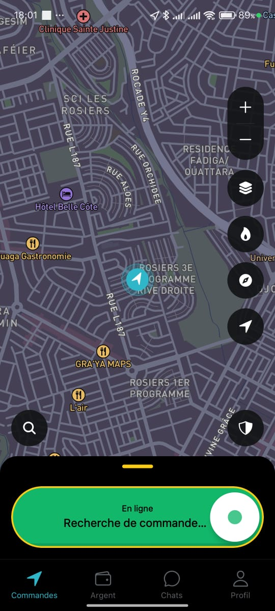
*IS2 (18:01) — Chauffeur en ligne : « Recherche de commande… », point de départ avant réception.*

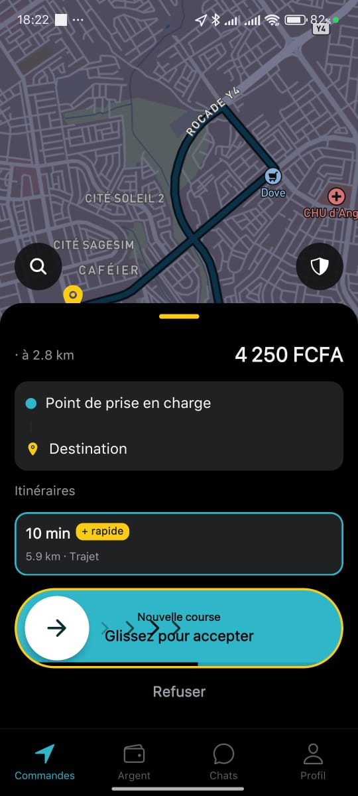
*I2S2 (18:22) — Réception d'une nouvelle commande : 4 250 FCFA, client à 2,8 km, « Glissez pour accepter ».*

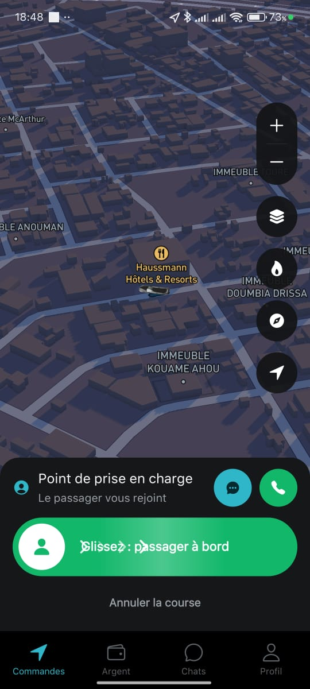
*I5S2 (18:48) — Arrivée au point de prise en charge : « Le passager vous rejoint », « Glissez : passager à bord ».*

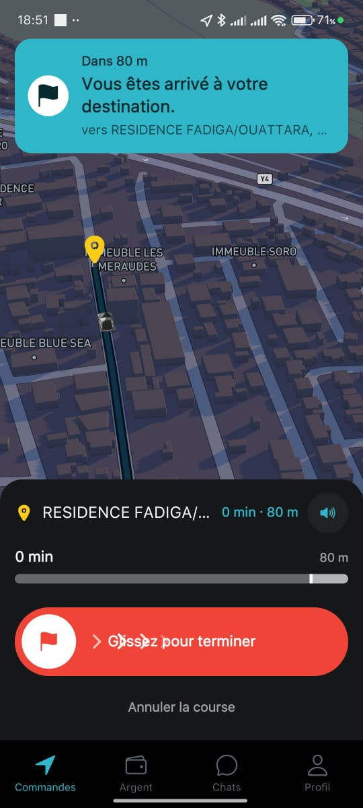
*I6S2 (18:51) — Fin de course : « Vous êtes arrivé à votre destination » (Résidence Fadiga/Ouattara), « Glissez pour terminer ».*

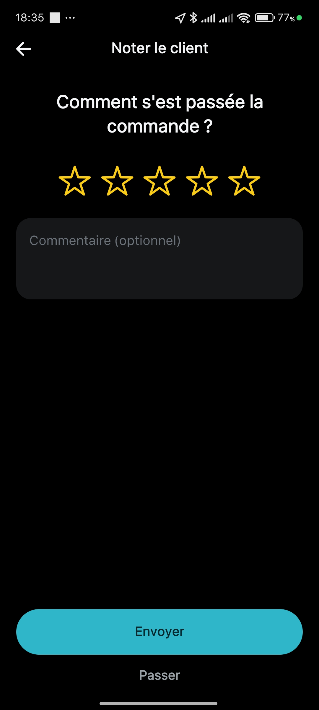
*I8S2 (18:35) — Notation du client en fin de course (« Comment s'est passée la commande ? »).*

### Observations

#### Navigation vocale

Nous disposions d'un guidage vocal fonctionnel qui indiquait les changements de direction. Cependant, **les distances annoncées vocalement étaient exprimées en miles** alors que le kilomètre est l'unité utilisée en Côte d'Ivoire (l'affichage à l'écran, lui, est bien en m/km).

**Recommandation :**

* Aligner le guidage vocal sur le système métrique — distances en kilomètres (km).

#### Lisibilité de la carte

Plusieurs difficultés ont été observées en navigation :

* L'itinéraire apparaissait en **noir sur un fond de carte sombre**, rendant sa lecture difficile.
* Le **marqueur représentant le client** était peu visible.
* Les **icônes de véhicules** du chauffeur et du client étaient très similaires.
* Le marqueur du client semblait **trop intégré à la carte**, ce qui compliquait son repérage.

**Recommandations :**

* Utiliser une couleur plus visible pour l'itinéraire (par exemple jaune).
* Remplacer l'icône du véhicule du chauffeur par une **grande flèche de navigation** plus facilement identifiable.
* Améliorer la visibilité du marqueur client.

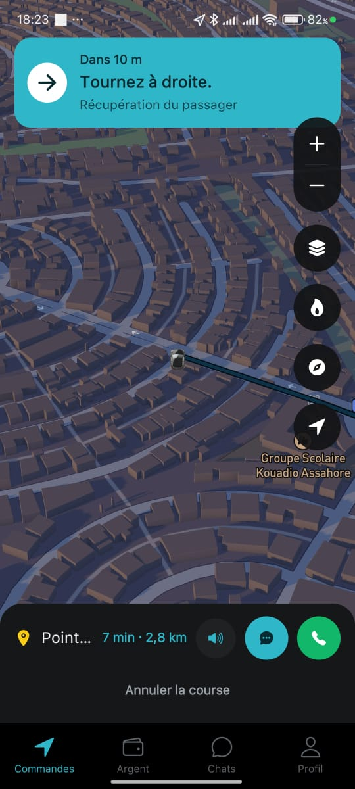
*I3S2 (18:23) — Récupération du passager (« Tournez à droite », 7 min · 2,8 km) : tracé sombre sur fond sombre.*

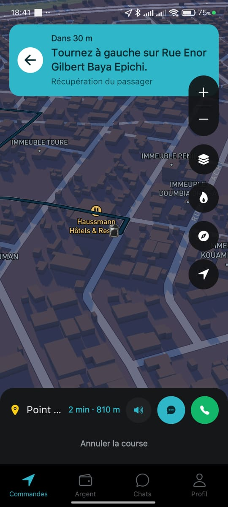
*I4S2 (18:41) — Navigation (« Tournez à gauche sur Rue Enor Gilbert Baya Epichi », 2 min · 810 m) : faible contraste de l'itinéraire.*

---

## Scénario 3 : Refus et redistribution de commande

### Objectif

* Chauffeurs 1 et 2 : laisser expirer la demande.
* Chauffeur 3 : refuser la demande.
* Chauffeur 4 : accepter la demande.

### Observation

Le Chauffeur 3 était positionné juste derrière les locaux de l'entreprise, qui constituaient le point de départ des tests. **Malgré sa proximité, il n'a reçu aucune demande**, restant en état « Recherche de commande… » (état identique à la capture *IS2*).

> *Aucune capture spécifique n'a été prise pour ce scénario : l'écran restait sur l'état « En ligne / Recherche de commande… » illustré par IS2.*

### Hypothèse

Cette situation pourrait être liée à une **mauvaise couverture réseau** dans la zone concernée.

### Recommandation

* Rejouer le scénario depuis une zone à meilleure couverture réseau afin de confirmer (ou d'écarter) la cause réseau et de valider la logique de refus / redistribution.

---

## Scénario 4 : Chauffeurs hors ligne

### Objectif

Mettre tous les chauffeurs hors ligne puis vérifier qu'aucune commande ne leur soit transmise.

### Résultat

**Test réussi.** Le chauffeur étant hors ligne, aucune commande n'a été reçue.

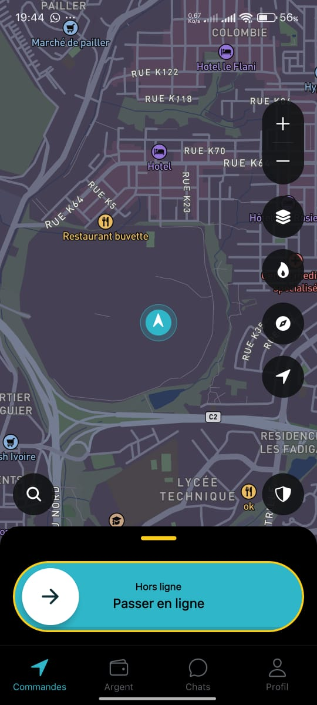
*IS4 (19:44) — État « Hors ligne » : bouton « Passer en ligne », aucune commande transmise.*

---

## Scénarios 5 et 6 : Annulation de course

### Scénario 5 — Annulation par le passager

* Le client effectue une commande.
* Le chauffeur accepte la course.
* Le client annule ensuite la commande.

**Résultat : succès.** Le chauffeur a été correctement notifié de l'annulation et est revenu en recherche de commande.

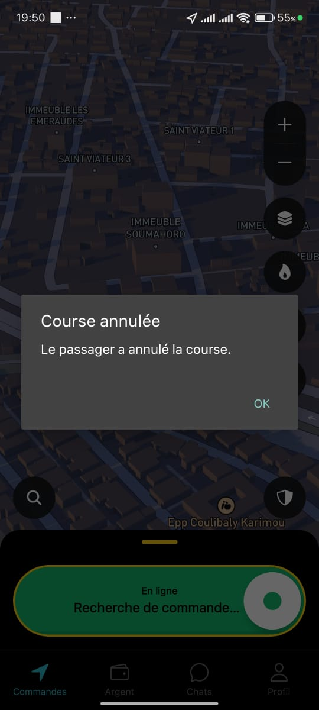
*I2S5 (19:50) — Notification « Course annulée — Le passager a annulé la course », retour automatique en « Recherche de commande… ».*

### Scénario 6 — Annulation par le chauffeur

* Le chauffeur accepte une course.
* Il navigue vers le point de récupération.
* Le chauffeur annule ensuite la course et sélectionne un motif, puis revient en recherche de commande.

**Résultat : succès.** L'application a proposé une liste de motifs d'annulation, avec mention explicite des **frais** pour certains motifs (« Annulation tardive », « Client absent »).

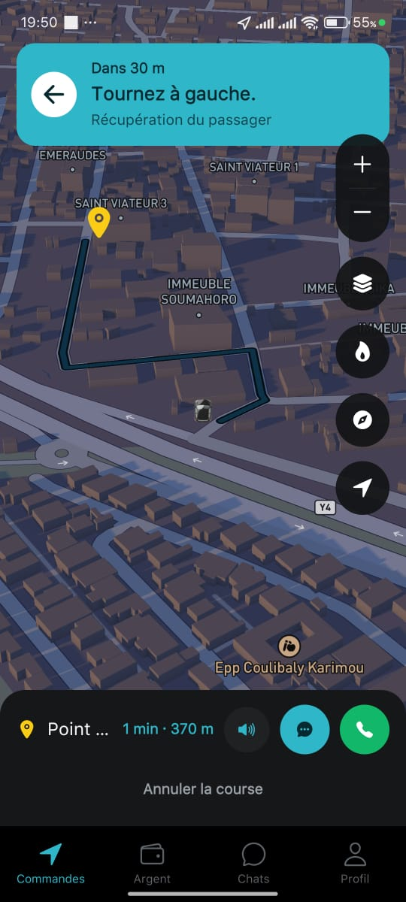
*I3S6 (19:50) — Course acceptée : navigation vers le client (« Tournez à gauche », 1 min · 370 m) avant annulation.*

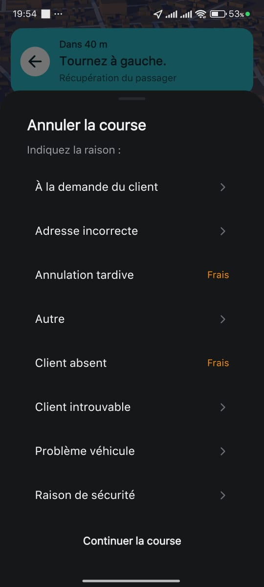
*IS6 (19:54) — « Annuler la course / Indiquez la raison » : motifs disponibles et indication « Frais ».*

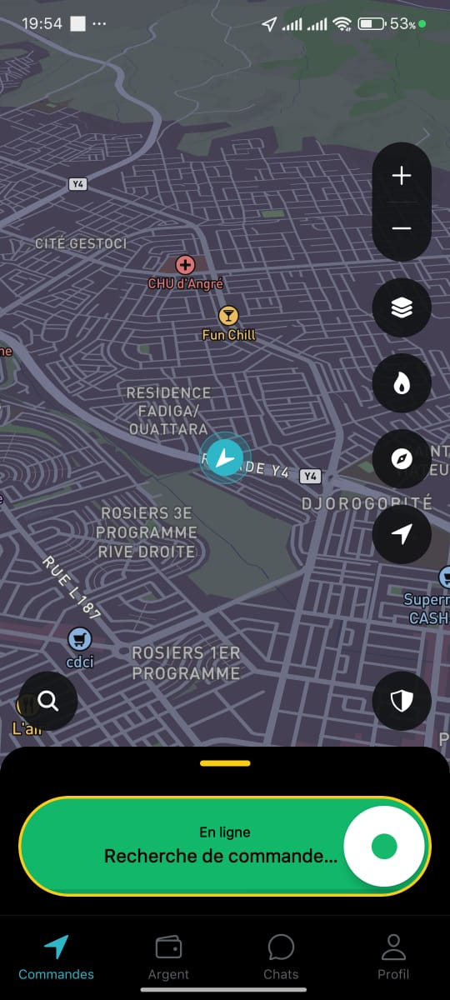
*I4S6 (19:54) — Après annulation : retour automatique en « En ligne / Recherche de commande… ».*

---

## Scénario 7 : Rechargement du portefeuille chauffeur

### Observation

Le test n'a pas pu être mené à son terme car le **solde Orange Money** utilisé pour l'opération était insuffisant.

Toutefois, nous avons pu constater l'affichage de l'interface USSD de validation de l'opérateur (rechargement de 500 FCFA via **Orange Money CI**, frais 0 FCFA, bénéficiaire « DUNYA DIGITAL PAYMENT CI »).

### Anomalie constatée

Le message affiché par l'interface de l'opérateur était **incomplet** :

> « Veuillez saisir votre »

Le texte ne précisait pas l'information attendue (le libellé s'interrompait avant l'élément à saisir).

### Recommandation

Compléter le message afin qu'il soit explicite, par exemple :

> « Veuillez saisir votre **code secret Orange Money** »

ou

> « Veuillez saisir votre **mot de passe** »

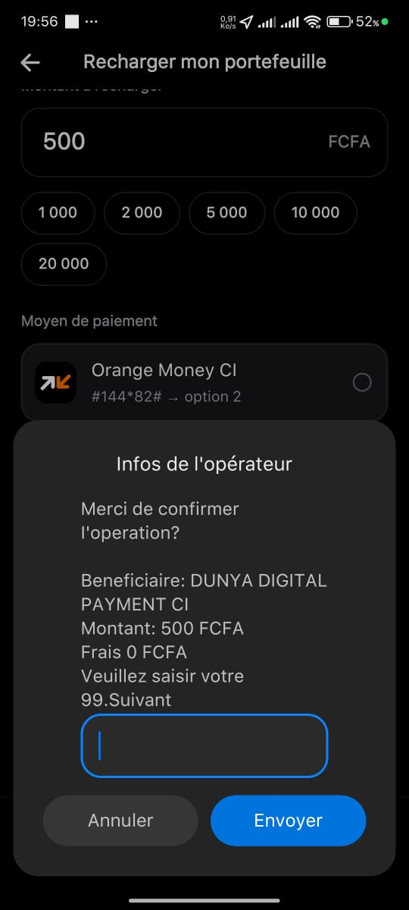
*IS7 (19:56) — « Recharger mon portefeuille » (500 FCFA, Orange Money CI) : pop-up opérateur affichant le message tronqué « Veuillez saisir votre ».*

---

## Scénario supplémentaire : Réception de commande pendant une course

Bien que non prévu dans la fiche de test, un scénario supplémentaire a été réalisé.

### Objectif

Vérifier qu'un chauffeur déjà engagé dans une course ne reçoive pas de nouvelles demandes.

### Résultat

**Test réussi.** Le chauffeur n'a reçu aucune nouvelle commande pendant l'exécution de sa course.

---

# Recommandations pour les futurs tests

## 1. Réaliser les tests en journée

Il serait préférable d'effectuer les tests entre **08h00 et 14h00** afin de bénéficier :

* d'une meilleure visibilité ;
* d'un repérage plus facile des lieux ;
* de meilleures conditions d'observation.

## 2. Choisir des points de référence connus

Certaines positions sélectionnées sur la carte se sont révélées difficiles d'accès, ce qui peut introduire un léger biais dans certains scénarios.

**Recommandation :** utiliser des lieux connus et facilement accessibles comme points de repère (stations-service, supermarchés, carrefours, écoles, etc.).

## 3. Optimiser le positionnement des chauffeurs

Certains chauffeurs sont arrivés avant d'autres en raison des distances à parcourir.

**Recommandation :** prévoir des **départs décalés** selon l'éloignement de chaque point afin que tous les participants soient positionnés au bon moment.

## 4. Mutualiser certains scénarios

Les points de destination utilisés dans le scénario 2 pourraient servir directement de points de départ pour le scénario 3.

Cela permettrait :

* de réduire les déplacements inutiles ;
* d'optimiser le temps d'exécution ;
* d'améliorer la fluidité de la campagne de tests.

---

## Conclusion

Dans l'ensemble, les scénarios testés ont été exécutés avec succès et les fonctionnalités principales se sont comportées conformément aux attentes. Les principales améliorations concernent **la lisibilité de la navigation, l'affichage cartographique, certains messages utilisateur** et **l'organisation logistique** des futures campagnes de tests. Le scénario 3 (Chauffeur 3 sans demande) reste à rejouer pour confirmer l'hypothèse réseau, et le scénario 7 (rechargement) à reconduire avec un solde suffisant.

---

## Annexe — Index des captures d'écran

| Fichier | Scénario | Heure | Contenu |
|---------|----------|-------|---------|
| `IS2.jpeg`  | 2 | 18:01 | Chauffeur en ligne, « Recherche de commande… » |
| `I2S2.jpeg` | 2 | 18:22 | Réception d'une nouvelle course (4 250 FCFA, 2,8 km) |
| `I3S2.jpeg` | 2 | 18:23 | Navigation vers le client (« Tournez à droite », carte sombre) |
| `I4S2.jpeg` | 2 | 18:41 | Navigation (« Tournez à gauche sur Rue Enor », 810 m) |
| `I5S2.jpeg` | 2 | 18:48 | Arrivée au point de prise en charge / embarquement |
| `I6S2.jpeg` | 2 | 18:51 | Arrivée à destination (« Glissez pour terminer ») |
| `I8S2.jpeg` | 2 | 18:35 | Notation du client en fin de course |
| `IS4.jpeg`  | 4 | 19:44 | Chauffeur hors ligne (« Passer en ligne ») |
| `I2S5.jpeg` | 5 | 19:50 | « Course annulée — Le passager a annulé la course » |
| `I3S6.jpeg` | 6 | 19:50 | Navigation vers le client avant annulation (370 m) |
| `IS6.jpeg`  | 6 | 19:54 | Annulation chauffeur : sélection du motif (« Frais ») |
| `I4S6.jpeg` | 6 | 19:54 | Retour en « En ligne / Recherche de commande… » |
| `IS7.jpeg`  | 7 | 19:56 | Rechargement portefeuille (Orange Money) + message USSD incomplet |
